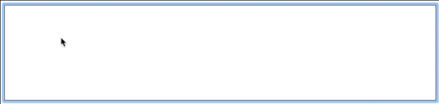

# RomanizAr

Live Arabic Transliteration in <code>contenteditable</code> elements.



### Usage

#### Defined Macros (snippets)

| Macro | Inserts | Represents |
--------|---------|-------------
|/,,/| ء | ʾ |
|/AA/| آ | Ā |
|/aa/|   | ā |
|/EE/| ي | Ī |
|/ee/|   | ī |
|/OO/| و | Ū |
|/oo/|   | ū |
|/HH/| ح | Ḥ |
|/hh/|   | ḥ |
|/KH/| خ | Ḵ |
|/kh/|   | ḵ |
|/DH/| ذ | Ḏ |
|/dh/|   | ḍ |
|/SH/| ش | Š |
|/sh/|   | š |
|/SS/| ص | Ṣ |
|/ss/|   | ṣ |
|/DD/| ض | Ḍ |
|/dd/|   | ḍ |
|/TT/| ط | Ṭ |
|/tt/|   | ṭ |
|/ZZ/| ظ | Ẓ |
|/zz/|   | ẓ |
|/cc/| ع | ʿ |
|/GH/| غ | Ġ |
|/gh/|   | ġ |

#### In your HTML

```HTML
<div id="my-editor-1"></div>
...
<script src="romanizar.js"></script>
```

#### In your JavaScript

```JavaScript
var editor = romanizar('#my-editor-1');
```

This is all you need for basic Arabic romanization.

### Adding Macros (snippets)

```JavaScript
editor.extend(mySnippets);
```

<code>snippets</code> must be an array of one or more objects that each define a __macro__ (pattern), delimited by '/', and the replacement __text__ it should expand to, for example:

```JavaScript
var mySnippets = [
    { macro: '/greet/', text: 'Hello' }
];
```


### Post Editing Hook

You can perform custom actions by adding functions to be called every time text is edited. Just add your callback:

```JavaScript
editor.onedit(callback);
```

And to remove the action:

```JavaScript
editor.offedit(callback);
```

### Works On
- Chrome
- Firefox
- Safari
- Newest IE (untested)

No support for IE TextRange planned.


### License

GPLv2.0, see ```license.md```
